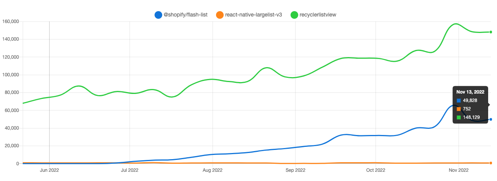

# Alternative libraries

기본적으로 FlatList 는 부드러운 스크롤을 위해서 콘텐츠를 비동기적으로 화면 렌더링을 트리거 합니다.
스크롤을 하게 되면, 보여지는 영역에 맞춰서 컴포넌트들의 mount/unmount 가 반복해서 일어나게 되고
이는 blank area 문제와 새로운 뷰 객체의 할당 및 해제로 인해 성능 문제를 초래합니다.

이런 FlatList 의 문제점을 개선하기 위해서 만들어진 세가지 라이브러리가 있습니다.

> - [react-native-largelist](https://github.com/bolan9999/react-native-largelist)
> - [RecyclerListView](https://github.com/Flipkart/recyclerlistview)
> - [FlashList](https://github.com/shopify/flash-list)

세가지 라이브러리 모두, 이미 렌더링 된 뷰를 재활용해서 메모리와 blank area 문제를 해결한다는게 핵심 기능입니다.
스크롤로 인해 보여지는 영역이 업데이트 되면, 렌더링할 데이터와 position 이 absolute 인 Cell 컴포넌트의 위치를 업데이트 해줍니다.
이로 인해서 컴포넌트의 위치와 렌더링 할 데이터(혹은 자식 컴포넌트)만 업데이트가 일어나게 되고, 이를 통해서 blank area 를 포함한 비용과 퍼포먼스 문제를 해결합니다.

|               | largelist | recyclerlistview | flash-list |
| ------------- | --------- | ---------------- | ---------- |
| Star          | 2.3k      | 4.6k             | 3k         |
| 버전          | v3.0.14   | v4.2.0           | v1.4.0     |
| 마지막 릴리즈 | 2019.05   | 2022.10.14       | 2022.11.08 |
| 문서화        | ⭐⭐⭐️   | ⭐⭐             | ⭐⭐⭐⭐⭐ |
| 개발경험      | ⭐⭐      | ⭐⭐             | ⭐⭐⭐⭐   |

RecyclerListView 가 가장 인기와 Star 가 높으나 문서화와 개발 경험이 그렇게 좋지 않았는데, 최근 Shopify 에서 이 RecyclerListView 를 기반으로
일부 성능 개선과 개발 경험을 향상시킨 FlashList 라이브러리를 배포했고 출시된지 6개월만에 무섭게 성장하고 있습니다.

_NPM Trends: recyclerlistview 를 디펜던시로 가지고 있어서, 함께 상승하는 모습_

만약 FlatList 에서만 제공되는 기능이 필요하지 않고, 대용량 리스트에서의 성능 최적화가 필요하다면 FlashList 사용을 고려해 볼것을 추천드립니다.

| FlatList                                                                     | FlashList                                                                    |
| ---------------------------------------------------------------------------- | ---------------------------------------------------------------------------- |
|  |  |

_퍼포먼스: FlatList 와 FlashList 의 성능 비교 (https://twitter.com/naqvitalha/status/1547224093962883072)_
